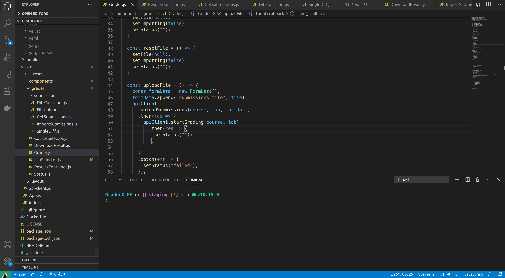
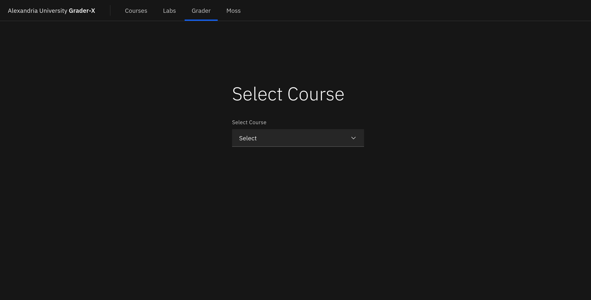

# Front-end Documentation
[](https://forthebadge.com)
[](https://forthebadge.com)

---

## Intro
This is the Front-end repo for the graderX project, which is specifically made to facilite the grading process for predefined problems.

It's completely made by volunteering students of Alexandria Univesity, under the direct supervision of Eng. Ahmed Hamdy.

---

## Prerequisites
* [ ] Docker (_specify version_)
* [ ] NodeJs (_specify version_)
* [ ] (optional) VSCode
  
---

## Installation Steps
1. Clone the repo
   ``` bash
   git clone https://github.com/CC451-Computer-Networks-TA-team/GraderX-FE
   ```


2. In the same directory of the project, write in the terminal (may take several minutes)
   ``` bash
   npm install 
   ```

---


## How It Works
### Running the App
1. Run Docker (may take several minutes for the first time)
   ``` bash 
   docker run -it -v GRADERX_BE_ABSOLUTE_PATH:/app -p 127.0.0.1:5000:5000 IMAGE_NAME 
   ```

   *OR*

   from VSCode Extensions => Launch VS Code Quick Open (Ctrl+P), paste the following command, and press enter. 
- `ext install ms-azuretools.vscode-docker`
- `ext install ms-vscode-remote.remote-containers` 
- follow the gif 👇
  


2. In the terminal, in the project directory
   ```bash
   npm start
   ```

Voila ✨, a browser tab opens with the application starting page




### APIs
Please check the APIs used to communicate with the back-end [here on Swagger](https://app.swaggerhub.com/apis/amohamed97/grader-x/1.0.0#/)


### Designs
 check the designs [here](https://drive.google.com/drive/folders/1XQxoNiS4Vzrq0QUx-bBQPktyA8NOmvKE?usp=sharing) 👈  

---

## Contribution
First things first, 

2. Fork the repo 🍴
3. Add a feature or fix a bug, and don't forget to document what you did
4. Send us a pull request

---

## How to Run Tests
Basically, all the tests reside in `__tests__` directory.

To run the test, write the following command in the termianl (in the project's directory)
``` bash
npm test
```
then press 'a'
